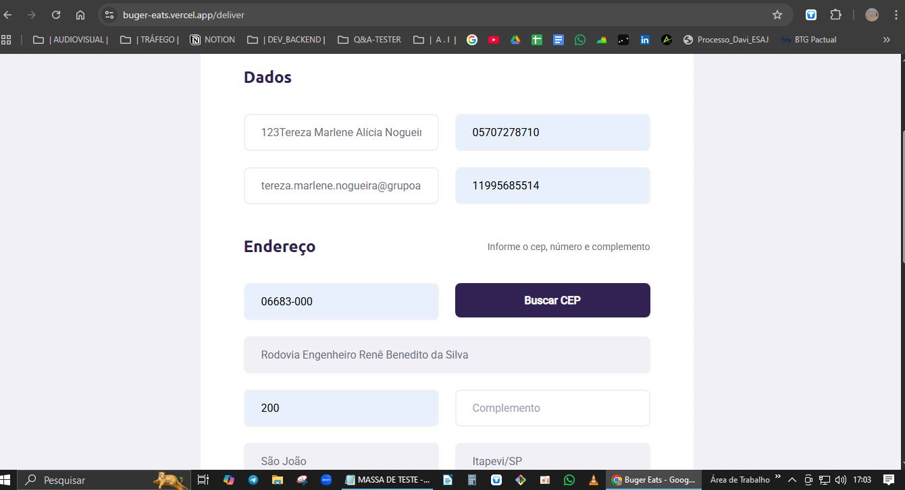
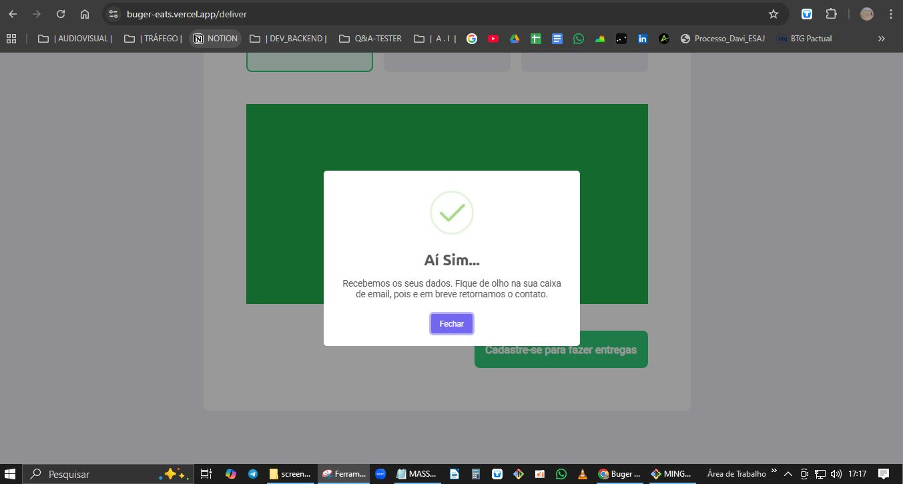
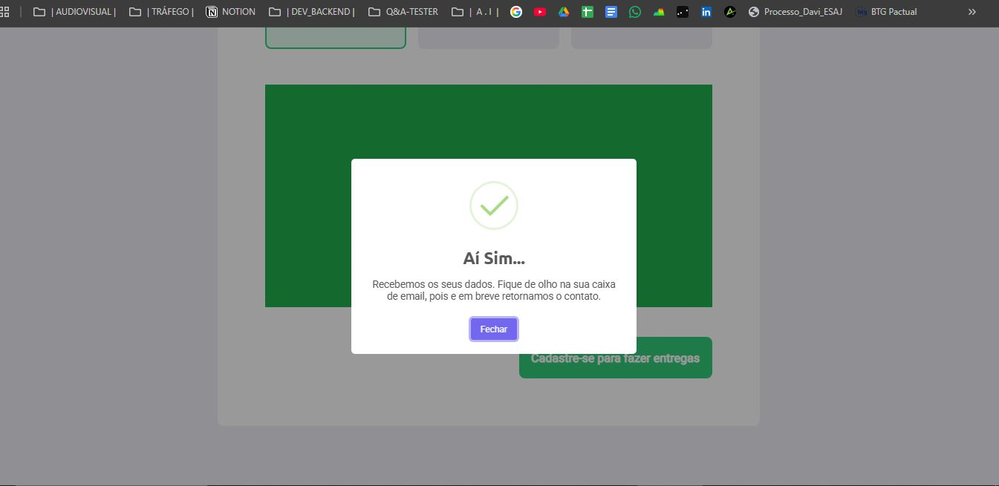
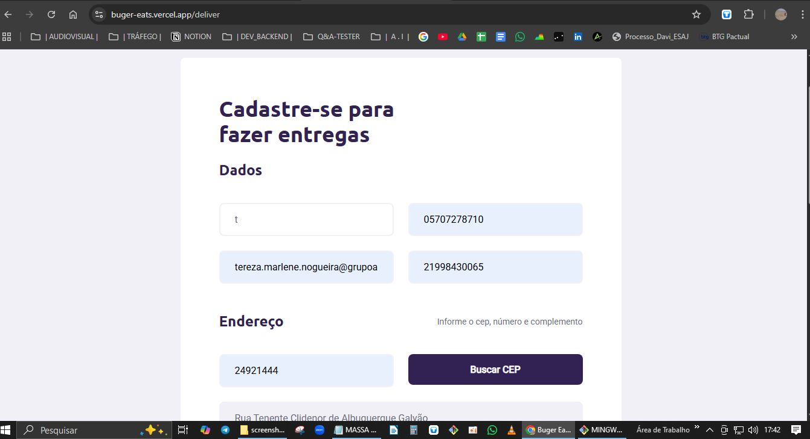
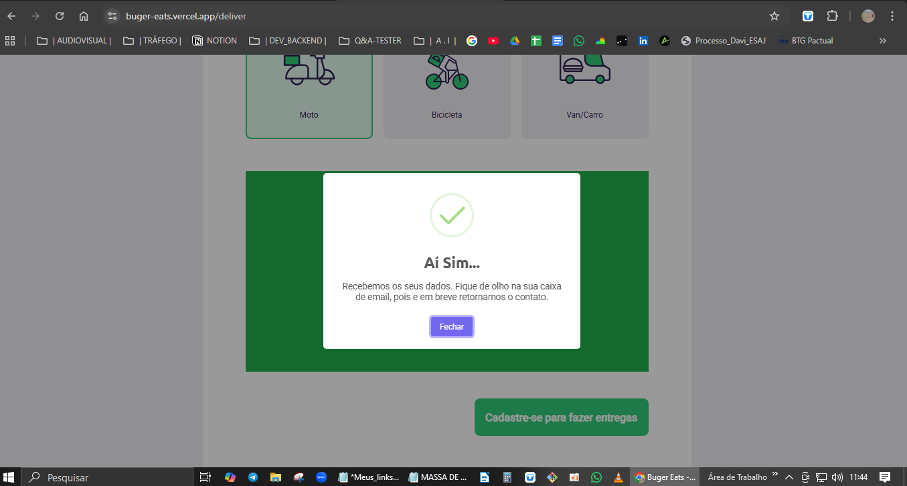
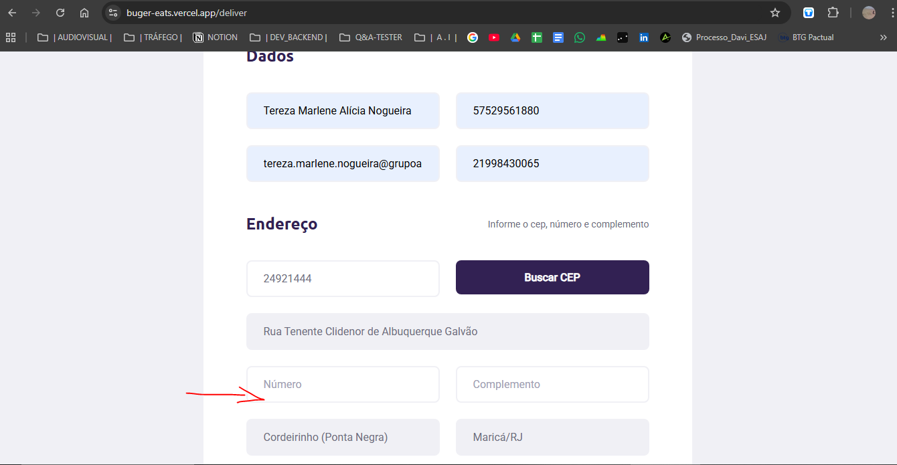
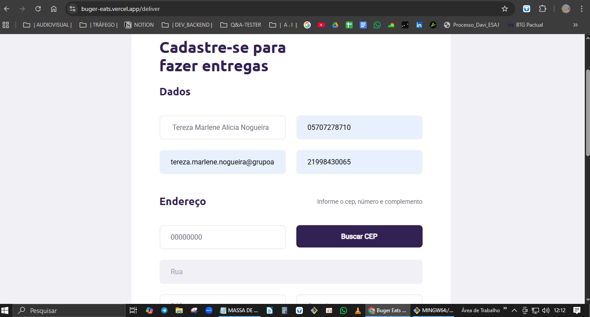
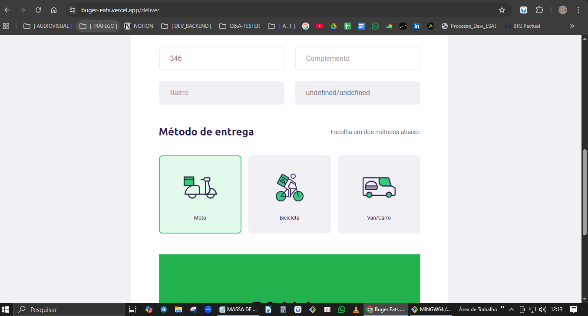
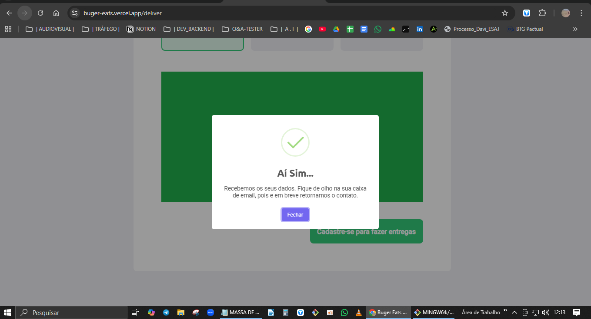

BUG-001

Título:
Email inválido sendo aceito no cadastro

Severidade:
Alta

Prioridade:
Alta

Ambiente:
Produção - Chrome

Passos para reproduzir:
1. Acessar o site
2. Ir para cadastro
3. Inserir email sem o ".com.br"
4. Enviar formulário

Resultado esperado:
Sistema deve validar e impedir envio

Resultado atual:
Cadastro é realizado normalmente

Evidência:

BUG-002

Título: Validar nome contendo números

Severidade: Alta

Prioridade: Alta

Ambiente: Produção - Chrome

Passos para reproduzir:
1. Acessar o site
2. Ir para cadastro
3. Inserir nome contendo números
4. Enviar formulário

Resultado esperado: Sistema deve validar e impedir envio
Resultado atual: Cadastro é realizado normalmente
Status: FAIL

Evidência:

BUG-003
Título: Validar nome contendo apenas um caractere

Severidade: Alta
Prioridade: Alta

Ambiente: Produção - Chrome

Passos para reproduzir:
1. Acessar o site
2. Ir para cadastro
3. Inserir nome contendo apenas um caractere, apenas letra 'T'
4. Clicar em "Cadastre-se para fazer entregas"

Resultado esperado: Sistema deve validar e impedir envio com caractere mínimo
Resultado atual: Cadastro é realizado normalmente com apenas um caractere
Status: FAIL

Evidência:

BUG-004
Título: Validar campo número não preenchido

C

Passos:

1. Deixar campo "Número" em branco
2. Preencher os demais campos corretamente
3. Clicar em "Cadastre-se para fazer entregas"

Resultado esperado: Sistema deve exigir preenchimento 
Resultado Atual: Sistema permitiu cadastro, mesmo com o campo "Número" não preenchido 
Status: FAIL
Evidência:

BUG-005
Título: Validar CEP inexistente  

Severidade: Alta
Prioridade: Alta

Ambiente: Produção - Chrome

Passos:
1. Preencher campo "CEP" com número inexistente   
2. Preencher os demais campos corretamente
2. Clicar em "Cadastre-se para fazer entregas"
   
Dados de teste:
Nome: Tereza Marlene Alícia Nogueira
CPF: 05707278710
Email: tereza.marlene.nogueira@grupoaguaviva.com.br
CEP: 012522-310
Número: 346
Celular: 21998430065
  
Resultado esperado: Sistema deve exibir erro
Resultado obtido: Sistema registrou CEP como "Undfefined" mas permitiu cadastro com CEP inexistente

Status: FAIL

Evidência:

